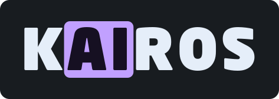

<p align="left">
  
</p>

[https://kyaulabs.com/](https://kyaulabs.com/)

[](CODE_OF_CONDUCT.md) &nbsp; [](https://www.conventionalcommits.org/en/v1.0.0/) &nbsp; [](LICENSE) &nbsp; [](https://github.com/zricethezav/gitleaks)  
[](https://semver.org) &nbsp; [](https://discord.gg/DSvUNYm)

Kairos is an experimental Kraken trading bot with Jev-assisted strategies and deterministic spot programs. A browser dashboard shows live prices, model assessments, orders, fills, and portfolio equity. Code enforces sizing and execution limits; Jev does not control those safeguards.

**Start with dry-run.** Live spot execution is implemented but has not been verified with real orders. Neither model confidence nor simulated returns establish profitability, and full-allocation trading can lose the entire allocation.

- [Capabilities](#-capabilities)
- [Quick start](#-quick-start)
- [Your first dry-run](#-your-first-dry-run)
- [Strategies](#-strategies)
- [Capital and recovery](#-capital-and-recovery)
- [Live trading](#-live-trading)
- [Deployment](#-deployment)
- [Development and CI](#-development-and-ci)
- [Project layout](#-project-layout)
- [Documentation](#-documentation)

## ✨ Capabilities

- Change the bot's market and strategy in Settings after stopping and reconciling orders; browse charts independently through the market picker.
- Use real Kraken data in dry-run without exchange orders; model-assisted strategies use Jev, while Bollinger scalping, DCA, TWAP, and rebalancing need no model calls.
- Choose the supplied Kairos dark/light brand palettes and violet, green, or red accents without changing the workspace layout or fonts.
- Use a single-screen workspace with a chart, Jev assessment, settings sidebar, and bottom tabs for orders, activity, portfolio, read-only exchange accounts, and equity.
- Monitor D3 candlesticks with aligned volume, candle-colored price badges, pan/zoom, crosshairs, and buy/sell markers. Star markets to keep their prices in the footer across browser sessions.
- Configure starting capital, order and exposure caps, daily loss limits, and reinvestment; trading fees come automatically from your Kraken account.
- Persist settings, order intents, fills, and portfolio accounting in SQLite.
- Protect network access with nginx Basic Auth over TLS.

| Product | Dry-run | Trading |
| --- | --- | --- |
| USD-quoted crypto spot | Simulated fills using real market data | Guarded Kraken limit orders |
| Crypto margin | Separate long/short simulation | Disabled |
| Direct US stocks and ETFs | Not yet supported | No brokerage integration verified |
| xStocks | Market data only; no simulator | Read-only accounts; execution disabled |
| USD linear crypto perpetuals | Separate funding-aware long/short simulation | Gated IOC/post-only orders; dedicated USD collateral |
| Inverse, dated and other Futures | Browse-only | Execution disabled |

Kraken's US stock product is not the same as xStocks. Kairos does not substitute tokenized assets for direct equities or submit guessed stock orders. See [supported trading](OPERATIONS.md#supported-trading) and the [Kraken CLI review](KRAKEN-CAPABILITIES.md) for verified coverage and integration limitations.

HTF, market making, DCA and TWAP support qualified linear perpetuals. [Bollinger range scalping](SCALPING.md) supports paper spot and paper linear Futures only. Futures need separate collateral accounting, live credentials and arming; see [Futures operation and limitations](FUTURES.md). Neither live spot nor Futures execution has been verified with real orders.

The candle chart defaults to 1m bars and refreshes Kraken OHLC snapshots roughly every five seconds, including the forming candle. Its selector offers 1m, 5m, 15m, 30m, 1h, 4h, and 1d bars independently of the strategy interval. Click the pair beside the logo to search spot/FX, margin-eligible crypto, xStocks, and Futures without changing the bot, even while it is running. The D3 assessment panel identifies the bot's configured market and assessment market. It shows model bias, score distribution, signal history and move/cost context; scalping instead shows rolling-window bands and the saved protection plan. These displays are not profitability probabilities.

The header shows the chart market's bid/ask midpoint, using the newest available WebSocket quote or public ticker snapshot. Picker and footer last-trade prices refresh about every ten seconds; stale prices are marked. The picker includes sortable rolling 24h change: spot/xStocks snapshots refresh about once a minute; Futures changes arrive with venue quotes. Volumes retain native asset or contract units. Favorites are stored in this browser, not the bot database. Live fills are detected during order reconciliation, not streamed directly from Kraken's private execution channel.

## 🚀 Quick start

Requires Linux, Python 3.12 or later, and [uv](https://docs.astral.sh/uv/). Model-assisted strategies also require a Jev API key. A Kraken Spot key with fee-query access is required even for paper trading; read-only permissions are enough. Futures fee queries use that same account's Spot key. There is no frontend build step; Node.js is needed only for development checks.

Active development is on `develop`:

```sh
git clone --branch develop https://github.com/kyaulabs/kairos.git
cd kairos
uv sync --locked

# Create a private environment file only if one does not already exist.
if [ ! -e .env ]; then
  install -m 600 .env.example .env
fi
```

Use your editor to configure `.env` from [.env.example](.env.example). Keep it private and out of Git.

| Setting | Purpose |
| --- | --- |
| `JEV_API_KEY` | TypeSafe API access; assessments can incur charges |
| `KRAKEN_API_KEY`, `KRAKEN_PRIVATE_KEY` | Kraken API key and signing secret |
| `KRAKEN_FUTURES_API_KEY`, `KRAKEN_FUTURES_PRIVATE_KEY` | Separate Derivatives credentials; read-only for browsing/accounts, order permission only for gated live Futures |
| `JEV_MODEL` | Defaults to `jev-latest` |
| `ALLOW_LIVE_TRADING` | Defaults to `false`; leave disabled for dry-run |
| `ALLOW_FUTURES_TRADING` | Defaults to `false`; live Futures require both flags and separate UI confirmation |
| `PUBLIC_ORIGIN` | Exact browser origin; defaults to `http://127.0.0.1:8000` |
| `PORT` | Loopback HTTP port, default `8000` |
| `DATA_DIR` | Persistent state directory, default `data` |

```sh
uv run kairos
```

Open <http://127.0.0.1:8000>. The server binds to loopback and always starts **paused in Dry-run**. Do not expose it directly to the network; use [nginx](#-deployment) for authenticated access.

## 🧪 Your first dry-run

1. In **Kairos settings > Strategy**, search the full market catalog and choose a supported bot market, strategy, and **Spot** product. Unsupported quote currencies, margin combinations, xStocks and unsupported Futures remain visible with explanations. Select the Futures product separately for a qualified linear perpetual. The header picker changes only the chart.
2. In **Capital**, set **Paper starting balance** to the amount you want to simulate, such as `100` USD.
3. Set **Order cap**, **Exposure cap**, the daily loss limit, and reinvestment explicitly in Capital. Review the read-only Kraken account rates in Execution. To size against the full starting allocation, set both caps to that allocation; changing the balance does not change the caps.
4. Save settings and click **Reset selected paper portfolio** to apply the new starting balance.
5. Press **Start** and watch the assessments, fills, and equity chart.

The default paper profile starts with $1,000 and reinvestment enabled. Changing the starting balance does not change an existing portfolio until you reset it. A reset discards simulated holdings, not live holdings, and retains labeled order/event history.

Dry-run uses real feeds; the model-assisted strategies make real Jev calls. Taker fills are estimated from visible depth; spot maker fills require later crossing trades, while Futures maker fills use later strictly crossing depth. Both assume limited participation. Neither model reconstructs actual queue priority or market impact.

## 📈 Strategies

| Strategy | Behavior |
| --- | --- |
| Higher-timeframe trend | Assesses completed candles from 1 minute through 1 day (1m, 5m, 15m, 30m, 1h, 4h, 1d). Code calculates trend and cost filters; Jev selects buy, sell, or hold. |
| Bollinger range scalping | Paper-only spot longs / linear Futures longs and shorts. Uses a rolling 1-minute window, band re-entry, trend/cost filters and a durable fixed target, stop and holding deadline. No Jev calls. |
| Market making | Posts one fee-aware, post-only quote and reconciles it before replacement. Quotes expire after 30 seconds. This is rate-limited market making, not exchange-grade HFT. |
| Triangular arbitrage | Checks both directions of a BTC/ETH-bridged spot triangle after fees, rounding, depth, and slippage. Jev can veto a computed opportunity. |
| DCA | Buys a fixed quote amount, including fees, for a finite number of scheduled purchases. Requires the full run budget up front; no missed-purchase catch-up. |
| TWAP | Splits a funded buy/sell parent into time-spaced IOC limit orders. Bounds quantity, duration, and price; unfilled slices are not added to later orders. |
| Threshold rebalancing | Adjusts an explicit spot basket and cash weight outside a drift band, with a cooldown, minimum trade, and UTC-day turnover cap. |

Arbitrage legs execute sequentially, not atomically. A failed or partial leg stops the engine with intermediate inventory retained for review. Retail fees may eliminate every observed opportunity.

DCA, TWAP, and rebalancing support paper and explicitly gated live spot. They make no model calls. Run identity, schedules, and confirmed fills persist; completed runs require explicit rearming. See [operation and configuration](OPERATIONS.md#strategies), the [retail roadmap](RETAIL-ROADMAP.md), and the [TradingAgents research review](TRADINGAGENTS-REVIEW.md).

Existing spot holdings remain tracked when you change markets, but the newly selected strategy does not automatically trade the previous market's holdings. Paper margin uses separate accounting and does not support triangular arbitrage. Read [strategy details](OPERATIONS.md#strategies) and [margin assumptions](OPERATIONS.md#margin-simulation) before using them.

## 💰 Capital and recovery

HTF, market making, arbitrage, and rebalancing have no scheduled end or profit target. DCA and TWAP stop after their finite run; their budgets do not grow automatically with profits. Continuous strategies reuse available capital and proceeds without forcing a trade when none qualifies. With reinvestment enabled, order and exposure caps scale with current equity relative to the initial allocation. Sizing reserves fees and respects exchange minimums.

For spot portfolios, **Recover original allocation once above 2× equity** can protect the starting allocation. With a $100 start, the bot attempts to reserve $100 only when active equity is greater than $200. It sells enough bot-owned inventory if cash is needed and execution limits permit, then excludes the reserve from future orders and compounds the remainder.

Recovery happens once and persists across restarts. It is a local accounting exclusion, not a separate Kraken wallet or external withdrawal. The cash stays on Kraken for you to withdraw manually. See [capital recovery](OPERATIONS.md#recover-the-original-investment) for timing and limitations.

## 🔴 Live trading

Keep the server live-write gate disabled until you have reviewed the [operating guide](OPERATIONS.md#dry-run-and-trading) and tested the strategy with paper funds.

1. Install a dedicated trade-capable Kraken key with the required query, order-creation, and cancellation permissions. **Do not grant withdrawal permission.**
2. Set `ALLOW_LIVE_TRADING=true` and restart. The app still starts paused in Dry-run.
3. Configure a positive live allocation and appropriate order, exposure, and loss limits. Confirm current Kraken account fees are available in Execution.
4. Switch **Execution** to **Trading — real funds** and confirm. If paused, press Start; a running engine resumes after successful reconciliation and preflight.

The switch cannot make a read-only key trade. The bot records order intents before submission and uses actual cumulative fills for live accounting. An uncertain submission or cancellation blocks further execution until reconciled.

Stop cancels tracked orders; **it does not sell spot holdings**. Loss limits also stop new trading rather than guarantee a maximum loss. Closing the browser does not stop the engine. Restarting the process does, and unresolved live orders require reconciliation before trading resumes.

## 📦 Deployment

Use [deploy/nginx.conf](deploy/nginx.conf) for TLS, Basic Auth, and unbuffered dashboard events. Protect the entire site, including API routes and static assets. Set `PUBLIC_ORIGIN` to the HTTPS hostname and keep the backend port inaccessible from the network.

The complete supplied brand pack is in [`brand/`](brand/README.md). The application uses its artwork and six palettes while retaining the viewport layout; use the sun/moon toggle and accent dropdown beside the header's execution badge. See [brand integration](BRANDING.md).

The UI uses locally installed Neo Sans Pro and OperatorMonoLig Nerd Font, with OperatorMonoSSmLig Nerd Font for bold monospace. Font Awesome Pro webfonts are optional, locally supplied assets excluded from Git. See [font setup](OPERATIONS.md#run-locally); missing fonts fall back to system text and text icons.

[deploy/kairos.service](deploy/kairos.service) provides an unprivileged systemd service example. Adapt the hostname, certificates, password file, user, and paths before installing either configuration. Full instructions are in [nginx and systemd](OPERATIONS.md#nginx-and-systemd).

Run only one process per data directory and do not share the bot's Kraken key with another order manager. Back up state while the process is stopped; losing the database loses the bot's allocation and reconciliation history.

## 💻 Development and CI

[GitHub Actions CI](.github/workflows/ci.yml) runs on pushes and pull requests, with a manual dispatch trigger. It checks Ruff lint and formatting, JavaScript syntax using Node.js 22, and the regression suite on Python 3.12, 3.13, and 3.14. Dependencies come from `uv.lock`; action revisions are pinned. CI has read-only repository permissions, no trading credentials, and does not run the real-API smoke test.

Run the same application checks locally:

```sh
uv sync --locked --dev
uv run --no-sync ruff check kairos tests
uv run --no-sync ruff format --check --output-format concise kairos tests
uv run --no-sync python -m unittest discover -v
node --check kairos/static/app.js
node --check kairos/static/settings.js
node --check kairos/static/chart.js
node --check kairos/static/markets.js
node --check kairos/static/strategy-market.js
node --check kairos/static/accounts.js
node --check kairos/static/appearance.js
node --test tests/*.test.cjs
```

The tests use mocked exchange/model responses and local HTTP fixtures. They cover execution gates, partial fills, uncertain submissions, risk limits, arbitrage recovery, principal recovery, paper margin, and API security. They do not verify live profitability or real-order execution.

For an optional integration check, stop the app first and run `uv run kairos-smoke --jev`. This makes read-only Kraken requests and one billable Jev assessment, but no exchange writes. See [verification](OPERATIONS.md#verification).

Install [Gitleaks](https://github.com/gitleaks/gitleaks), then enable the repository hooks once per clone:

```sh
npm install -g @commitlint/cli @commitlint/config-conventional
git config --local core.hooksPath .github/hooks
```

The executable hooks scan staged changes for secrets and validate conventional commit messages. Commits require GPG signatures and detailed bodies. Work on a branch, commit and push each verified change separately, and use a pull request into `develop`; do not commit or push directly to `main` or `develop`.

## 📁 Project layout

```text
kairos/                  Exchange/model clients, strategies, accounting, and server
kairos/static/           Dashboard and self-hosted D3 assets
tests/                   Regression tests and exchange/model fixtures
deploy/                  Nginx and systemd examples
.github/workflows/ci.yml Lint and test automation
.env.example             Environment variable names and safe defaults
OPERATIONS.md            Detailed setup, execution, recovery, and deployment guide
```

## 📚 Documentation

- [Operating guide](OPERATIONS.md)
- [Retail API coverage and strategy roadmap](RETAIL-ROADMAP.md)
- [Brand integration](BRANDING.md) and [TradingAgents review](TRADINGAGENTS-REVIEW.md)
- [Contributing](CONTRIBUTING.md) and [security policy](SECURITY.md)
- [Kraken Exchange API](https://docs.kraken.com/exchange/api-reference/overview)
- [TypeSafe Jev documentation](https://docs.typesafe.ai/introduction)
- [Jev Trader](https://github.com/jarrodwatts/jev-trader), the reference project that inspired this bot
- [Project license](LICENSE), [bundled D3 license](kairos/static/vendor/D3-LICENSE), and [currency icon source/license](kairos/static/vendor/crypto-icons/NOTICE.md)
